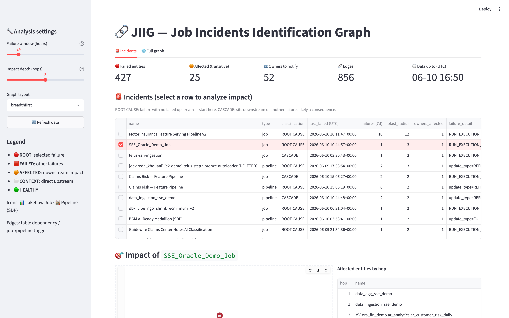
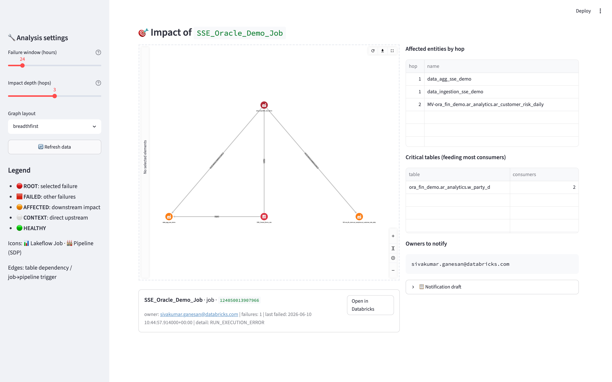
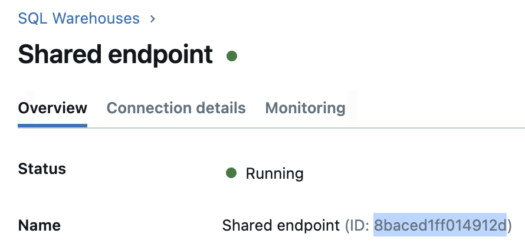
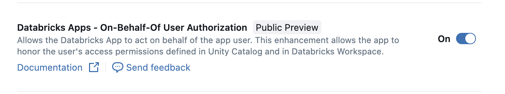

# JIIG

JIIG denotes "Job Incidents Identification Graph". <br>
A single Job may generate multiple tables that serve as inputs for other downstream Jobs. When a failure occurs, administrators must determine the downstream dependencies and notify affected teams. Currently, admin teams identify failed Jobs and manually trace their downstream sub-Jobs before notifying the respective owners via Slack. This manual failure-handling process typically takes more than hours, consuming significant time and resources. <br>
The goal of this project is to automate the detection and impact analysis of Lakeflow Job and Pipeline (Lakeflow Spark Declarative Pipelines, SDP) failures using system tables and table lineage information. The solution also provides an incident-centric visualization of dependencies — representing Jobs and Pipelines as nodes and their relationships as edges — through a Databricks App, enabling teams to quickly understand the scope of an incident.

Everything is computed from **native system tables only** — no auxiliary notebooks, no user-ID mapping tables, and no event-log scanning jobs are required.

| Source | Used for |
|---|---|
| `system.lakeflow.jobs` / `system.lakeflow.pipelines` | Entity metadata (SCD2, latest row), owner emails (`creator_user_name`, `run_as_user_name`) |
| `system.lakeflow.job_run_timeline` | Job failures (`FAILED`, `ERROR`, `TIMED_OUT`) and activity |
| `system.lakeflow.pipeline_update_timeline` | Pipeline (SDP) update/refresh failures (`result_state = 'FAILED'` on `REFRESH` / `FULL_REFRESH`), job→pipeline trigger links |
| `system.access.table_lineage` | Table-level dependency edges (via `entity_metadata`) |

The dashboard provides,
- Failed Job or Pipeline IDs, Name, failure detail (termination code / failed update)
- Affected Job or Pipeline IDs, Name, creator/run_as email, affected_tables
- **Multi-hop impact**: `hop_distance` (how many dependency hops away) and `impact_path` (e.g., `Job A -> Pipeline B -> Job C`) — a failure's transitive blast radius, not just direct consumers
- Two kinds of dependency edges: **table dependency** (producer writes a table the consumer reads) and **job→pipeline trigger** (a job task starts a pipeline update)

- This project is DABs (**Databricks Asset Bundles**)
- For information on using **Databricks Asset Bundles in the workspace**, see: [Databricks Asset Bundles in the workspace](https://docs.databricks.com/aws/en/dev-tools/bundles/workspace-bundles)
- For details on the **Databricks Asset Bundles format** used in this asset bundle, see: [Databricks Asset Bundles Configuration reference](https://docs.databricks.com/aws/en/dev-tools/bundles/reference)


The network graph App is **incident-centric**:
- Incident list of failed entities, sorted by blast radius, with **ROOT CAUSE / CASCADE** classification (a failure sitting downstream of another failure is flagged as a cascade)
- Select an incident to render only its impact subgraph (selected failure + downstream up to N hops + direct upstream context) — the full graph is never loaded into the canvas, so it stays responsive at any workspace size
- Insight panel per incident: affected entities by hop, critical tables (feeding most consumers), owners to notify (copyable), and a ready-to-send notification draft
- A capped "Full graph" overview tab (failed nodes always kept, the rest ranked by degree)




## Getting Started
Before deploy, you should modify databricks.yml
### Setting Up Databricks CLI
The new Databricks CLI (v0.205+) is required — the legacy `pip install databricks-cli` package does not support `bundle` commands.
```bash
# Check current version (should be >= 0.205)
databricks --version

# Install or Update the CLI
# macOS
brew tap databricks/tap && brew install databricks
# Linux/macOS (script)
curl -fsSL https://raw.githubusercontent.com/databricks/setup-cli/main/install.sh | sh
```
See: [Install the Databricks CLI](https://docs.databricks.com/aws/en/dev-tools/cli/install)

### Log in to your Databricks workspace
```bash
databricks auth login --host https://your-workspace-url.cloud.databricks.com --profile your-profile-name
```

### Deploying JIIG with DABs
```bash
# Deploy to dev environment
databricks bundle deploy -t dev --profile your-profile-name

# Or Deploy to prod environment
databricks bundle deploy -t prod --profile your-profile-name
```

### Start App or Job
```bash
# Run the table-refresh job (dev)
databricks bundle run jiig_job -t dev --profile your-profile-name

# Start the graph app (dev)
databricks bundle run job_dependency_graph -t dev --profile your-profile-name

# Same for prod with -t prod
```

### To check resources per target
```bash
# View summary for default target(dev)
databricks bundle summary --profile your-profile-name

# View summary for specific target
databricks bundle summary -t prod --profile your-profile-name
```

## Variables in databricks.yml
```yaml
  warehouse_id:
    lookup:
      # Replace this with the name of your SQL warehouse.
      warehouse: dbdemos-shared-endpoint
  workspace_id:
    description: workspace id
    default: 1444828305810485
  account_name:
    description: Customer Name # Will be used for a dashboard title
    default: MyCompany
  jiig_catalog:   # Tables for dashboard and Graph will be stored under jiig_catalog
    description: Base catalog
    default: shared
  jiig_schema:    # Per-target schema isolates dev/prod (created automatically)
    description: Base schema (per deployment target)
    default: stefano_jiig_${bundle.target}
  failure_lookback_days:    # Failures within this window are analyzed
    default: 7
  lineage_lookback_days:    # Lineage within this window defines dependency edges
    default: 30
  impact_max_depth:         # Max downstream hops for impact analysis
    default: 5
  jiig_dag_table:       # Graph table (nodes + edges for the App)
    default: ${var.jiig_catalog}.${var.jiig_schema}.dag_relationships
  dashboard_table:      # Dashboard table (multi-hop failure impact pairs)
    default: ${var.jiig_catalog}.${var.jiig_schema}.jiig_dashboard
```

### App configuration
When deploying with DABs, the App environment (`DAG_TABLE_NAME`, `DATABRICKS_WAREHOUSE_ID`, `FAILURE_LOOKBACK_DAYS`) is set automatically from the bundle variables via the `config` block in `resources/jiig.apps.yml` — no manual editing required. <br>
For manual (non-bundle) deployments only, uncomment and set the values in `src/apps/app.yaml`:
```yaml
  - name: DAG_TABLE_NAME
    value: "your_catalog.your_schema.dag_relationships_dev"
  - name: DATABRICKS_WAREHOUSE_ID
    value: "your_warehouse_id"
  - name: FAILURE_LOOKBACK_DAYS
    value: "7"
```
- You can find warehouse id in COMPUTE > SQL WAREHOUSE


### Dashboard configuration
No post-deploy manual steps are required. The dashboard dataset references the table by bare name (`jiig_dashboard`), and the bundle injects the catalog/schema at deploy time via the `dataset_catalog` / `dataset_schema` fields in `resources/jiig.dashboard.yml`. Changing `jiig_catalog` / `jiig_schema` bundle variables is enough — see [bundle dashboard resource reference](https://docs.databricks.com/aws/en/dev-tools/bundles/resources). (Requires a recent Databricks CLI; tested with v0.297.)

### Project Structure
```
.
├── databricks.yml
├── README.md
├── resources
│   ├── figures
│   │   └── *.png
│   ├── jiig.apps.yml
│   ├── jiig.dashboard.yml
│   └── jiig.job.yml
├── scratch
│   └── README.md
└── src
    ├── apps
    │   ├── app.py            # Incident-centric Streamlit UI
    │   ├── app.yaml          # Fallback config for manual deploys
    │   ├── conn.py           # Warehouse connection (OBO with SP fallback)
    │   ├── graph_utils.py    # BFS / blast radius / insight helpers
    │   └── requirements.txt
    ├── dashboard
    │   └── jiig-dashboard.lvdash.json
    └── job
        ├── jiig-dag-table-creation.sql        # Graph nodes & edges
        └── jiig-dashboard-table-creation.sql  # Multi-hop impact pairs
```

### Requirements and Operation
* This is an administration service, **WORKSPACE_ADMIN** permission is required.
   * If not, permission to read the system catalog is required (`system.lakeflow`, `system.access`).
* System schemas `system.lakeflow` and `system.access` must be enabled on the metastore. Note that `system.lakeflow.pipelines` and `system.lakeflow.pipeline_update_timeline` are in Public Preview.
* A SQL warehouse is required (both job tasks are SQL tasks; serverless compute is no longer needed).
* Pipeline (SDP) failure detection now comes directly from `system.lakeflow.pipeline_update_timeline` — the LDP event-log consolidator notebook and the user-ID mapping notebook from earlier versions have been removed.
   * Owner emails come from `creator_user_name` / `run_as_user_name` in the system tables. Entities not modified since ~Dec 2025 may show a numeric ID instead (the columns are not backfilled); the value falls back to the raw ID in that case.
* Failure-detection tables are regenerated every 30 minutes by the schedule; run the jiig job manually to refresh sooner.
* On-behalf-of user authorization for Apps should be enabled
   

### Contribution
We are waiting your pull requests. Please leave any idea about dashboard and graph.

### Disclaimer
The main author (stefano-jang) is a Solutions Architect at Databricks. However, this project is not part of any official company work and was initiated solely as a personal good-will effort. It does not come with any guaranteed SLA, nor does it provide official support. If you intend to use this code in your production environment, please review it thoroughly and assume full responsibility for its use.
