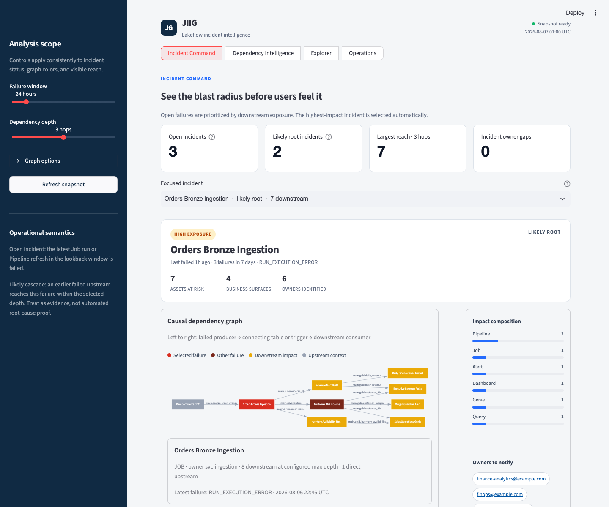
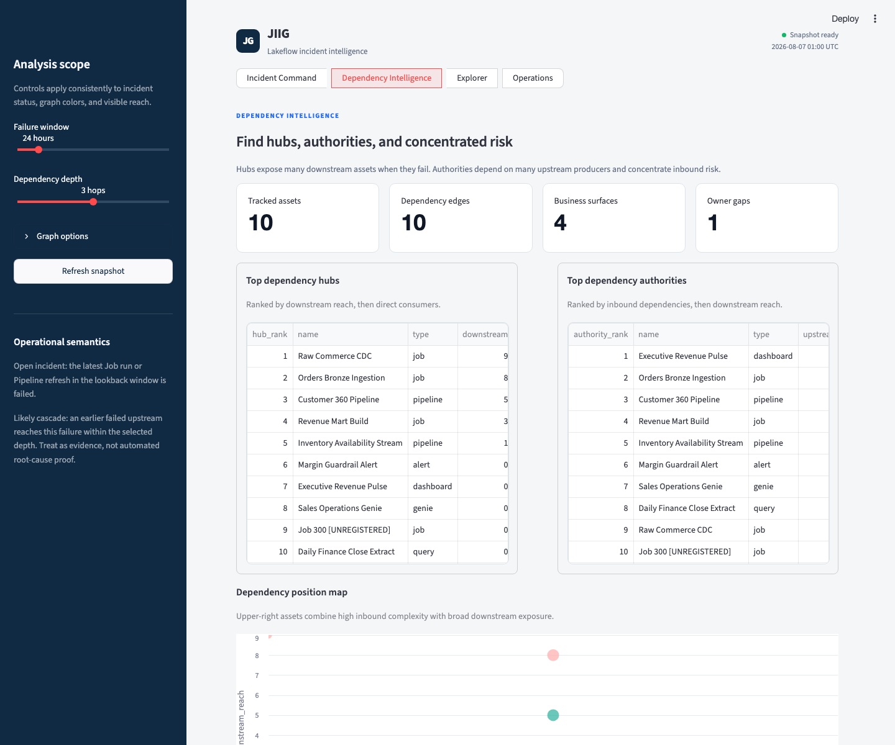

# JIIG 2.0 — Lakeflow Incident Intelligence

When a Databricks Lakeflow Job or Pipeline fails, the operational question is not only **“what failed?”** It is **“which downstream Jobs, Pipelines, dashboards, Genie spaces, queries, and alerts may now be stale—and who needs to act?”**

JIIG turns native Databricks system-table lineage into an incident command surface:

- Prioritizes open failures by downstream blast radius.
- Distinguishes likely root incidents from likely cascades using multi-hop paths and failure timing.
- Shows the intermediate tables and triggers that explain every impact path.
- Identifies downstream owners and produces a ready-to-share incident brief.
- Ranks dependency hubs and authorities so teams can find systemic risk before an outage.
- Provides a focused upstream/downstream explorer instead of an unreadable workspace hairball.

No auxiliary mapping table, event-log scanner, or notebook is required.

## Product experience

### Incident Command

The highest-impact open incident is selected automatically. Responders immediately see exposure, affected business surfaces, owners, the causal graph, and table-level evidence.



### Dependency Intelligence

Hub and authority views explain which assets have the broadest downstream reach and which concentrate the most inbound dependency risk.



The screenshots use the repository's anonymous demo fixture. They contain no customer or employee data.

## What JIIG provides

| Surface | Purpose |
|---|---|
| **Incident Command** | Open incident queue, likely root/cascade evidence, scoped blast radius, causal graph, affected assets, owners, critical data contracts, incident brief |
| **Dependency Intelligence** | Top hubs, top authorities, dependency position map, shared-write governance signals |
| **Dependency Explorer** | Search any asset and inspect a connected upstream/downstream neighborhood and causal paths |
| **Operations** | Snapshot freshness, ownership gaps, entity coverage, shared-table review queue |
| **AI/BI dashboard** | Managed companion view over open failure-to-impact pairs for workspace reporting |

## Incident semantics

JIIG 2.0 makes the following distinctions explicit:

- **Open incident**: the latest Job run or Pipeline refresh inside the lookback window is failed. A later successful run clears the active incident.
- **Likely root**: no earlier failed upstream reaches this failure within the selected depth.
- **Likely cascade**: an earlier failed upstream reaches this failure, including through healthy intermediate assets.
- **At risk**: a downstream dependency exists in the lineage window. This is potential stale-data exposure, not proof that every output table was corrupted.
- **Business surface**: a terminal Dashboard, Genie space, SQL query, or alert that may expose stale results to users.

Root/cascade classification is operational evidence, not automated root-cause proof. Confirm the failure and table state before remediation.

## Architecture

The scheduled SQL job runs every 30 minutes and builds three Delta tables:

```text
system.access.table_lineage
system.lakeflow.jobs / pipelines
system.lakeflow.job_run_timeline
system.lakeflow.pipeline_update_timeline
                │
                ▼
lineage_edges
  EDGE + SHARED_TABLE rows
       ├──────────────────┐
       ▼                  ▼
dag_relationships       jiig_dashboard
nodes, edges, ranks     open failure × affected asset
       │                  │
       ▼                  ▼
JIIG App              AI/BI dashboard
```

| Output table | Purpose |
|---|---|
| `lineage_edges` | Canonical dependency, orchestration-trigger, and table-trigger edges; shared-write tables above the fan-out cap |
| `dag_relationships` | Kind-qualified graph nodes/edges, failure state, snapshot timestamp, degrees, reach, hub rank, authority rank |
| `jiig_dashboard` | Open failed entity × downstream affected entity pairs with hop distance, intermediate tables, path, and owner |

See [`docs/architecture.md`](docs/architecture.md) for the full data contract and correctness rules.

## Quick start

### 1. Prerequisites

- Databricks CLI `0.292.0` or later
- A SQL warehouse
- Access to the required system tables
- A Unity Catalog catalog/schema where JIIG can create its output tables

```bash
databricks --version
databricks auth profiles
```

Choose the intended profile explicitly for every command. JIIG never assumes a default workspace.

### 2. Configure bundle variables

Set the warehouse lookup name in `databricks.yml`:

```yaml
variables:
  warehouse_id:
    lookup:
      warehouse: your-sql-warehouse-name
```

`workspace_id` has no default and is intentionally required. Obtain the numeric workspace ID from the workspace URL (`?o=<workspace_id>`) or workspace admin settings.

Other commonly changed variables:

| Variable | Default | Purpose |
|---|---:|---|
| `jiig_catalog` | `shared` | Output catalog |
| `jiig_schema` | `jiig_${bundle.target}` | Per-target output schema |
| `failure_lookback_days` | `7` | Run/update history used for active incident state and failure count |
| `lineage_lookback_days` | `30` | Observed lineage window used to define dependencies |
| `impact_max_depth` | `5` | Maximum downstream traversal depth; keep at `1–5` |
| `max_table_fanout` | `20` | Writer cap above which a table is treated as a shared-write governance signal |
| `include_consumer_kinds` | `DASHBOARD,QUERY,GENIE,ALERT` | Terminal business surfaces included in impact analysis |

### 3. Validate, deploy, and refresh

```bash
databricks bundle validate -t dev \
  --profile <profile> \
  --var="workspace_id=<numeric-workspace-id>"

databricks bundle deploy -t dev \
  --profile <profile> \
  --var="workspace_id=<numeric-workspace-id>"

databricks bundle run jiig_job -t dev \
  --profile <profile> \
  --var="workspace_id=<numeric-workspace-id>"

databricks bundle run job_dependency_graph -t dev \
  --profile <profile> \
  --var="workspace_id=<numeric-workspace-id>"
```

The development target pauses schedules by default. The production target enables the 30-minute schedule after a successful production deployment.

## Required permissions

The deployment identity needs:

- `CAN USE` on the SQL warehouse.
- `SELECT` on `system.access.table_lineage`.
- `SELECT` on the required `system.lakeflow` system tables.
- `USE CATALOG` and `USE SCHEMA` on the output location.
- `CREATE SCHEMA` when the configured schema does not exist.
- `CREATE TABLE`, `MODIFY`, and `SELECT` on the JIIG output schema/tables.

App users need access to the deployed app, SQL warehouse, catalog/schema, and `SELECT` on `dag_relationships`. The app uses the forwarded user token when available and otherwise falls back to the app service principal, so administrators must scope both identities deliberately.

## Local UI demo

The explicit demo mode uses a small anonymous graph and never connects to Databricks:

```bash
python3 -m venv .venv
source .venv/bin/activate
pip install -r src/apps/requirements.txt

PYTHONPATH=src/apps \
JIIG_DEMO_MODE=true \
streamlit run src/apps/app.py
```

`JIIG_DEMO_MODE` is disabled by default and is not set in the bundle deployment.

## Correctness and scale safeguards

- Only `direct_access = true` lineage records create direct dependency edges.
- Node IDs are canonical `KIND:id` values, preventing Job/Pipeline/consumer ID collisions.
- One run/update is counted once even when its timeline spans multiple rows.
- An incident remains open only when the latest run/update is failed.
- Jobs and Pipelines missing from current metadata remain visible when run history or lineage proves they exist.
- Sentinel trigger IDs such as `SQL_SCHEDULE` are excluded.
- Parallel dependency/trigger edges are merged before traversal.
- Shared-write tables above `max_table_fanout` are reported separately instead of creating a writers × readers edge explosion.
- The app loads scoped incident subgraphs; it does not load the full workspace graph during incident triage.

## Known limitations

- Impact is inferred from observed entity-to-table lineage. JIIG does not currently identify the exact failed task output within a multi-task Job, so exposure is intentionally labeled potential.
- Lineage is asynchronous and can lag behind workload activity.
- Monthly or quarterly dependencies outside `lineage_lookback_days` may be absent.
- Configured Run Job dependencies are not included unless they also appear through observed table lineage or supported trigger metadata.
- `system.lakeflow.pipelines` and `system.lakeflow.pipeline_update_timeline` may be in preview depending on workspace/cloud rollout.
- `max_table_fanout` is a heuristic and can exclude a legitimate wide-write dependency table.
- System metadata may expose a principal ID rather than a human email; unresolved ownership is shown as an explicit operational gap.
- Hub rank uses bounded downstream reach and direct out-degree. Authority rank uses inbound degree. They are structural signals, not business-criticality scores.

## Project structure

```text
.
├── databricks.yml
├── docs
│   ├── architecture.md
│   └── product-review.md
├── resources
│   ├── figures
│   │   ├── jiig_incident_command.png
│   │   └── jiig_dependency_intelligence.png
│   ├── jiig.apps.yml
│   ├── jiig.dashboard.yml
│   └── jiig.job.yml
├── scripts
│   └── capture_demo_screenshots.py
├── src
│   ├── apps
│   │   ├── app.py
│   │   ├── conn.py
│   │   ├── demo_data.py
│   │   ├── graph_utils.py
│   │   └── run_app.py
│   ├── dashboard
│   │   └── jiig-dashboard.lvdash.json
│   └── job
│       ├── jiig-lineage-edges.sql
│       ├── jiig-dag-table-creation.sql
│       └── jiig-dashboard-table-creation.sql
└── tests
    ├── test_demo_data.py
    └── test_graph_utils.py
```

## Disclaimer

JIIG is a community project and is not an official Databricks product. Review its SQL, permissions, operational semantics, and incident process before production use. No SLA or official support is provided.
