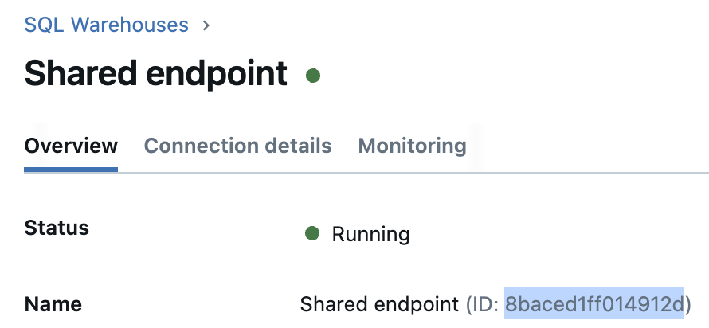
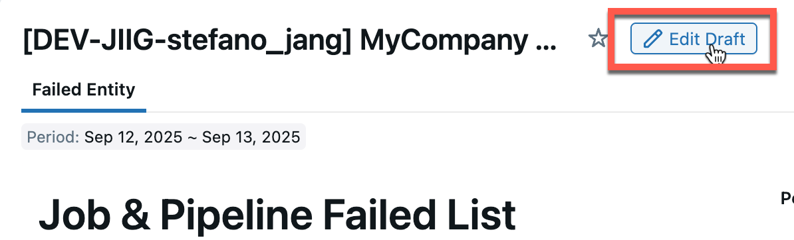
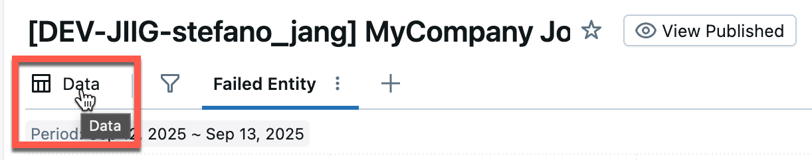
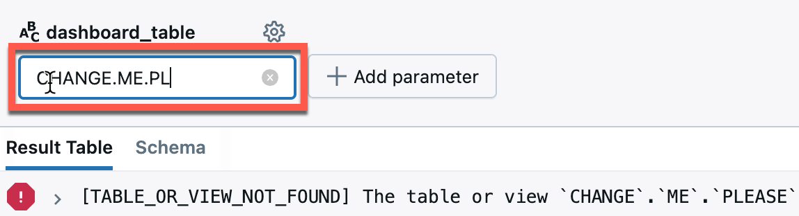
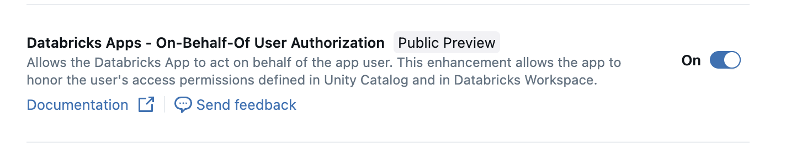

# JIIG 

JIIG denotes "Job Incidents Identification Graph". <br>
A single Job may generate multiple tables that serve as inputs for other downstream Jobs. When a failure occurs, administrators must determine the downstream dependencies and notify affected teams. Currently, admin team identifies failed Jobs and manually traces their downstream sub-Jobs before notifying the respective owners via Slack. This manual failure-handling process typically takes more than hours, consuming significant time and resources. <br>
The goal of this project is to automate the detection and impact analysis of Job and Pipeline failures using system tables and table lineage information. The solution will also provide a visualization of dependencies—representing Jobs and Pipelines as nodes and their relationships as edges—through a Databricks App, enabling teams to quickly understand the scope of an incident.

The dashboard provides,
- Failed Job or Pipeline IDs, Name
- Affected Job or Pipeline IDs, Name, creator/run_as email, affected_tables <br>
_(affected_tables: Job A creates Table_1, Job B creates Table_2 based on Table_1, if Job A fails, the affected table is Table_1)_

- This project is DABs (**Databricks Asset Bundles**)
- For information on using **Databricks Asset Bundles in the workspace**, see: [Databricks Asset Bundles in the workspace](https://docs.databricks.com/aws/en/dev-tools/bundles/workspace-bundles)
- For details on the **Databricks Asset Bundles format** used in this asset bundle, see: [Databricks Asset Bundles Configuration reference](https://docs.databricks.com/aws/en/dev-tools/bundles/reference)


The network graph provides,
- Dependency of failed Job or Pipeline IDs, Name


## Getting Started
Before deploy, you should modify databricks.yml
### Setting Up Databricks CLI
```bash
# Check current version
databricks --version

# Install or Update the CLI
pip install -U databricks-cli
```

### Log in to your Databricks workspace
```bash
databricks auth login --host https://your-workspace-url.cloud.databricks.com --profile your-profile-name
```

### Deploying JIIG with DABs
```bash
# Deploy to dev environment
databricks bundle deploy -t dev --profile your-profile-name

# Or Deploy to prod environment
databricks bundle deploy -t prod --profile your-profile-name
```

### Start App or Job
```bash
# Start the app in dev environment
databricks bundle run -t dev --profile your-profile-name

# Start the app in prod environment
databricks bundle run -t prod --profile your-profile-name 
```

### To check resources per target
```bash
# View summary for default target(dev)
databricks bundle summary --profile your-profile-name

# View summary for specific target
databricks bundle summary -t prod --profile your-profile-name
```

## Variables in databricks.yml
```yaml
warehouse_id:
    lookup:
      # Replace this with the name of your SQL warehouse.
      warehouse: dbdemos-shared-endpoint
  workspace_id:
    description: workspace id
    default: 1444828305810485
  account_name:
    description: Customer Name # Will be used for a dashboard title
    default: MyCompany 
  jiig_catalog:   # Tables for dashboard and Graph will be stored under jiig_catalog
    description: Base catalog
    default: shared
  jiig_schema:
    description: Base schema
    default: stefano_jiig
  user_id_map_table_name:    # System table only provide user ID, so we have to map it to email
    description: Target table name of user ID and email mapping job
    default: ${var.jiig_catalog}.${var.jiig_schema}.user_id_map_${bundle.target}
  ldp_error_table:       # Pipeline error detecting tables
    description: Target table name of LDP update error detection job
    type: complex
    default:
      # Only process last N days (None for all data)
      days_back: 30
      # Find LDP errors from source_catalogs (delimiter: comma, all: all)
      #source_catalogs: all
      source_catalogs: shared,stefano-test-catalog
      # Save Error detection results to output_catalog.output_schema.dlt_error_analysis
      output_catalog: ${var.jiig_catalog}
      output_schema: ${var.jiig_schema}
      full_name: ${var.ldp_error_table.output_catalog}.${var.ldp_error_table.output_schema}.dlt_error_analysis
  jiig_dag_table:       # Graph table
    description: Table for network node and edge information
    default: ${var.jiig_catalog}.${var.jiig_schema}.dag_relationships_${bundle.target}
  dashboard_table:      # Dashboard table
    description: Table for dashboard information
    default: ${var.jiig_catalog}.${var.jiig_schema}.jiig_dashboard_${bundle.target}
```

### Modify src/apps/app.yaml
```yaml
  - name: DAG_TABLE_NAME
    value: "shared.stefano_jiig.dag_relationships"
  - name: DATABRICKS_WAREHOUSE_ID
    value: "862f1d757f0424f7"
```
- You can find warehouse id in COMPUTE > SQL WAREHOUSE


### After deploy, modify and re-publish dashboard dataset variable
- Find dashboard, go to draft mode 


- Click Data


- change dashboard_table variable to yours(Default : CHANGE.ME.PLEASE)


### Project Structure
```
.
├── databricks.yml
├── README.md
├── resources
│   ├── figures
│   │   ├── jiig_dashboard_data.png
│   │   ├── jiig_dashboard_draft.png
│   │   ├── jiig_dashboard_parameter.png
│   │   ├── jiig_dashboard_table.png
│   │   ├── jiig_dashboard.png
│   │   ├── jiig_graph.png
│   │   ├── jiig_obo.png
│   │   └── jiig_warehouse_id.png
│   ├── jiig.apps.yml
│   ├── jiig.dashboard.yml
│   └── jiig.job.yml
├── scratch
│   └── README.md
└── src
    ├── apps
    │   ├── app.py
    │   ├── app.yaml
    │   ├── conn.py
    │   └── requirements.txt
    ├── dashboard
    │   └── jiig-dashboard.lvdash.json
    └── job
        ├── jiig-dag-table-creation.sql
        ├── jiig-dashboard-table-creation.sql
        ├── jiig-ldp-analysis.ipynb
        └── jiig-userid-map.ipynb
```

### Requirements and Operation
* This is an administration service, **WORKSPACE_ADMIN** permission is required.
   * If not, permission to read system catalog is required.
   * If you don't have read permissions for tables under the **ldp_error_table.source_catalogs**, pipeline failures cannot be detected (TBD).
   ```python
   # all table names match 'event_log', 'dlt_event_log' are parsed
   if any(pattern in table.lower() for pattern in ['event_log', 'dlt_event_log'])
   ```
* Serverless should be enabled in your workspace.
* Every job failure detection table is newly generated every 30 minutes, to accelerate you should manually run the jiig job.
* System tables don't have Lakeflow Declarative Pipelines(LDP) event logs for now. So we're using LDP event colsolidator.
   * see: [LDP event consolidator by Alex Linke](https://github.com/alinke5/LDP_eventLog_consolidator)
* On-behalf-of user authorization for Apps should be enabled
   

### Contribution
We are waiting your pull requests. Please leave any idea about dashboard and graph.